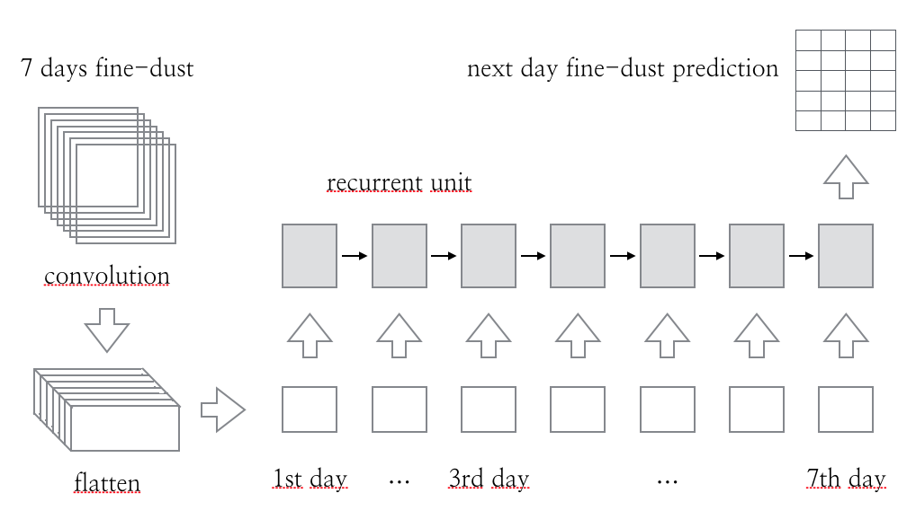
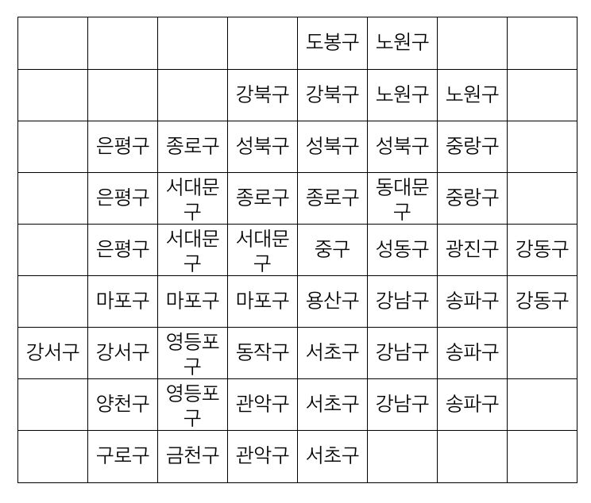
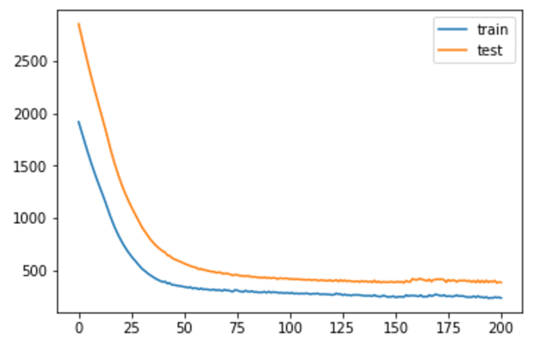
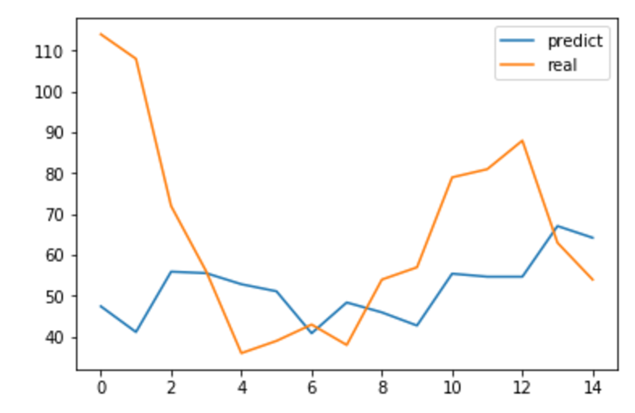

# Fine-Dust-Prediction
Prediction of daily average amount of fine dust by tensorflow.

## Pre-processing
Pre-processing the daily average amount of the fine dust(pm10) to bundle it in 7 days.

For the convolution layer, the amount of fine dust for each region is mapped to the geographical map of Seoul, 9x8 matrix.

The data was extracted from the csv file [Seoul Daily Average Air Pollution Degree Information](http://data.seoul.go.kr/openinf/sheetview.jsp?infId=OA-2218&tMenu=11) provided by the Seoul Open Data Plaza.

## CRNN Model

Input [None, 7, 9, 8] matrix, which represents 7days of the fine-dust data.

Convolution each layer (per day) separately with 3x3 sized, 1x16, 16x32, 32x64 filter.

Flatten each layer and pass it to the recurrent unit.

Calculate estimates of the amount of fine dust on next day via three fully connected layer (2048, 512, 25).

## Conclusion

Training it and model was converged.

Unfortunately, learning did not work out better than I thought.

In addition to the fine-dust, the accuracy can be improved by adding wind direction or date information.

