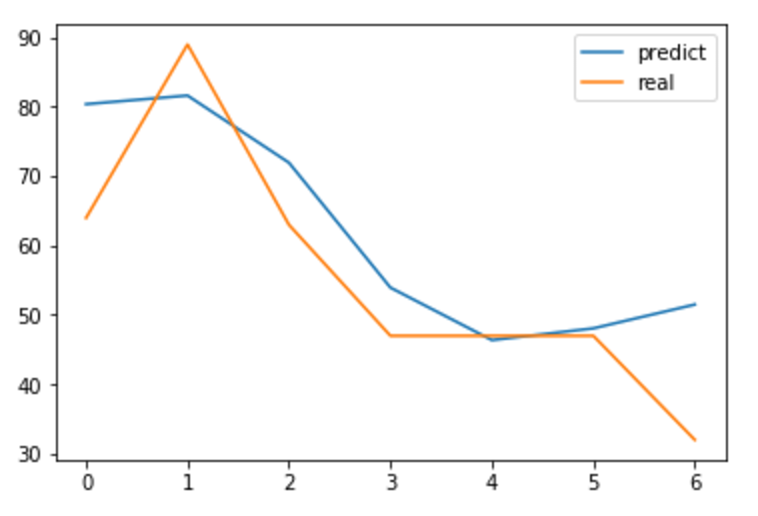

# Fine-Dust-Prediction
Prediction of the daily average amount of the fine dust by tensorflow.

## Pre-processing
Pre-processing the daily average amount of the fine dust(pm10) to bundle it in 7 days.

For the convolution layer, the amount of fine dust for each region is mapped to the geographical map of Seoul, 9x8 matrix.

The data was extracted from the csv file [Seoul Daily Average Air Pollution Degree Information](http://data.seoul.go.kr/openinf/sheetview.jsp?infId=OA-2218&tMenu=11) provided by the Seoul Open Data Plaza.

## ConvLSTM Model

[Convolutional LSTM](https://arxiv.org/abs/1506.04214) is similar as LSTM, but it calculate hidden states by convolution not fully-connected.

Feed 5D Tensor (time_dim, batch_size, height, width, channel) to the ConvLSTM Cell and it returns hidden unit and state.

There is [prediction](https://github.com/revsic/Fine-Dust-Prediction/blob/master/Fine-Dust-Prediction.ipynb) and [forecasting](https://github.com/revsic/Fine-Dust-Prediction/blob/master/Fine-Dust-Forecaster.ipynb) models. Prediction model flatten an output of the last ConvLSTM Cell by 1x1 convolution and calculate MSE loss with the next day's fine dust.

Forecasting model is the Stacked ConvLSTM Encoder-Decoder model. Stacked encoder summary the sequential data to the fixed-length vector and it is feeded to an initial state of the decoder model. Stacked decoder model generate stacked sequential data and flatten it by 1x1 convolution. It produces 7 days prediction.

## Conclusion

Training it and model was converged.

In addition to the fine-dust, the accuracy can be improved by adding wind direction or date information.

*Prediction*  

*Forecaster*  

